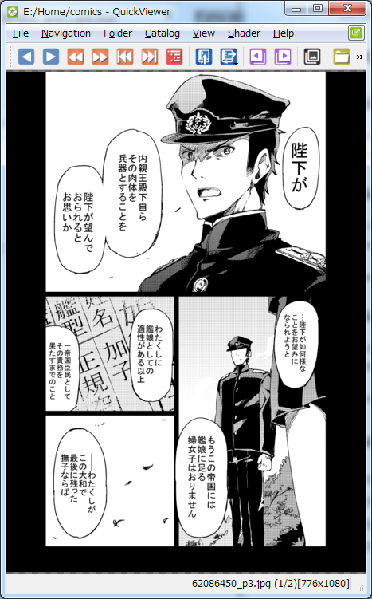

# Shaders

Changing the options in the QuickViewer's Shader menu will change the look of your image.
This is because the interpolation method to reduce the image is changed.

On this page, we will explain the difference in each option.

## Summary

- Normally, in many cases **Bilinear interpolation** will be OK.
- If you are hard to read a fine letter or you are reading Japanese comics please try **Bicubic interpolation by CPU**.
- Selecting **CPU Bicubic after GPU Bilinear** will animate though drawing speed and quality are compatible.
- If you are dissatisfied with the above options, please try **Bicubic or Lanczos interpolation**.

## About the sample image

In the following explanation, as a sample image, a reduced image of Japanese free comic "赤き血潮に(for Red Blood)" is used.
About the use on this page, I have obtained permission from 相生青唯(AIOI Aoi) of the author.

To see the original about [赤き血潮に(www.pixiv.net)](https://www.pixiv.net/member_illust.php?mode=medium&illust_id=62086450)

This is [the original image](62086450_p3.jpg) of the following reduced image.

### 1. Bilinear interpolation

It is a standard interpolation method of QuickViewer, and it is enough for many images as it is. It will look similar to Windows Photo Viewer.

### 2. Bicubic and Lanczos interpolation

With these options, we try to draw higher quality by using Shader Program (Fragment Shader).
For 50-100% magnification, it seems that it often shows better results than bilinear interpolation.

These options do not work properly on some PCs, as the load on the GPU is higher than usual.

### 3. Bicubic interpolation by CPU

This option is shrunk by the CPU, not the GPU. It is usually the best quality. Especially in Japanese manga.
Because it does not use the function of GPU, it will work normally on old PC.

You may feel dissatisfied if drawing is not too fast, but we still do our best :)

## Comparison of reduction results

